Modul 2 : DNS dan Web Server

Nama anggota :
- 05111840000093 Muhammad Afif Fadhlurrahman 
- 05111740000091 Affan Ahsanul Habib

**1. Membuat alamat http://semeruyyy.pw**
- Pada UML MALANG jalankan perintah : </br>
`nano /etc/bind/named.conf.local`
- Isi konfigurasi seperti berikut (UML MALANG) :
```
zone "semerud01.pw" {
	type master;
  notify yes;
  also-notify { 10.151.79.19 };
	file "/etc/bind/jarkom/semerud01.pw";
};
```
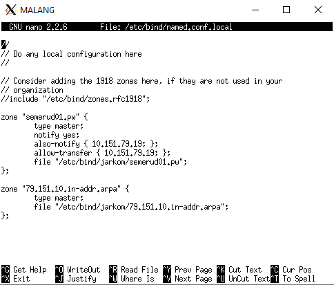
- Isi konfigurasi pada file `/etc/bind/jarkom/semerud01.pw` seperti berikut (UML MALANG) : </br>
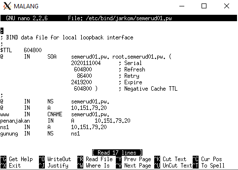
- Setelah selesai setting maka kita restart bind9 dengan perintah (UML MALANG) </br>
`service bind9 restart`
- Kemudian atur nameserver pada client (contoh pada UML GRESIK) </br>
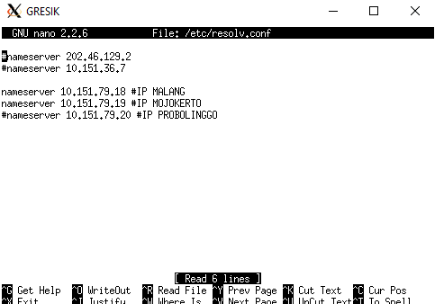
- Testing (UML GRESIK) </br>
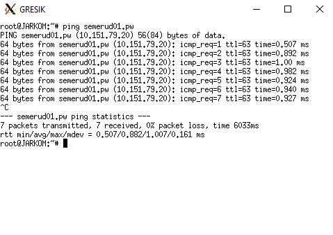

**2. alamat http://semeruyyy.pw memiliki alias http://www.semeruyyy.pw**
- Isi konfigurasi pada file `/etc/bind/jarkom/semerud01.pw` seperti berikut (UML MALANG) : </br> 
*yang perlu diperhatikan adalah record CNAME agar kita bisa membuat alias </br>

- Kemudian kita restart bind9 dengan perintah (UML MALANG) </br>
`service bind9 restart`
- Cek dengan melakukan host -t CNAME www.semeruyyy.pw. Hasilnya harus mengarah ke host dengan IP MALANG. </br>


**3. subdomain http://penanjakan.semeruyyy.pw yang diatur DNS-nya pada MALANG dan mengarah ke IP Server PROBOLINGGO**
- Lihat konfigurasi seperti pada gambar (file /etc/bind/jarkom/semerud01.pw) di UML MALANG, apakah sudah ada record A penanjakan pada filenya, karena hal tersebut yang menjadikan kita bisa membuat subdomain `penanjakan.semerud01.pw` </br>

- Lakukan perintah `service bind9 restart` pada UML MALANG
- Kemudian lakukan perintah `host -t A penanjakan.semerud01.pw` pada UML GRESIK </br>
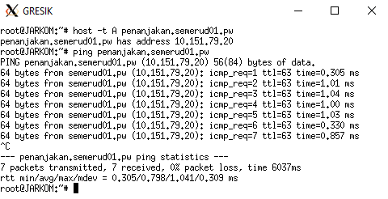

**4. Membuat reverse domain untuk domain utama.**
- Buka file menggunakan perintah `nano /etc/bind/named.conf.local` pada UML MALANG
- Perhatikan konfigurasi berikut apakah sudah ada di dalam file named.conf.local
```
zone "79.151.10.in-addr.arpa" {
    type master;
    file "/etc/bind/jarkom/79.151.10.in-addr.arpa";
};
```
- Jalankan perintah `cp /etc/bind/db.local /etc/bind/jarkom/79.151.10.in-addr.arpa` pada UML MALANG
- Perhatikan dan edit sesuai pada gambar </br>
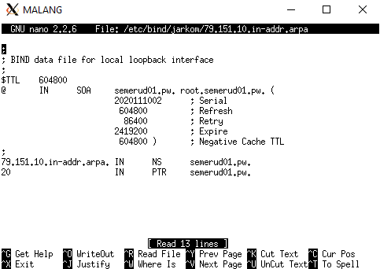
- Lakukan perintah `service bind9 restart` pada UML MALANG </br>
- Jalankan perintah `host -t PTR 10.151.79.20` </br>
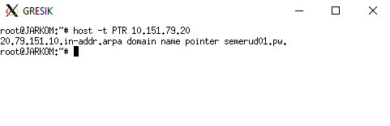

**5. Membuat DNS Server Slave pada MOJOKERTO**
- Edit file /etc/bind/named.conf.local dan sesuaikan dengan syntax berikut pada UML MALANG
```
zone "semerud01.pw" {
	type master;
  	notify yes;
 	also-notify { 10.151.79.19 };
  	allow-transfer { 10.151.79.19 };
	file "/etc/bind/jarkom/semerud01.pw";
};
```
- Lakukan perintah `service bind9 restart` pada UML MALANG
- Kemudian buka file /etc/bind/named.conf.local pada MOJOKERTO dan tambahkan syntax berikut:
```
zone "semerud01.pw" {
    type slave;
    masters { 10.151.79.18 }; 
    file "/var/lib/bind/semerud01.pw";
};
```
- Lakukan perintah `service bind9 restart` pada UML MOJOKERTO
- Pada server MALANG matikan bind9 dengan perintah `service bind9 stop`
- Pada client GRESIK pastikan pengaturan nameserver mengarah ke IP MALANG dan IP MOJOKERTO </br>

- Lakukan ping ke semerud01.pw pada client GRESIK. </br>
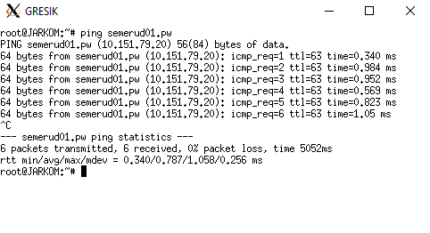

**6. Membuat subdomain dengan alamat http://gunung.semeruyyy.pw yang didelegasikan pada server MOJOKERTO dan mengarah ke IP Server PROBOLINGGO.**
- Edit file dengan menggunakan perintah `nano /etc/bind/jarkom/semerud01.pw`, perhatikan record NS pastikan hal tersebut sudah sesuai (UML MALANG) </br>

- Edit file dengan menggunakan perintah `nano /etc/bind/named.conf.options`
- Kemudian comment `dnssec-validation auto;` dan tambahkan baris berikut pada `/etc/bind/named.conf.options` </br>
`allow-query{any;};` </br>
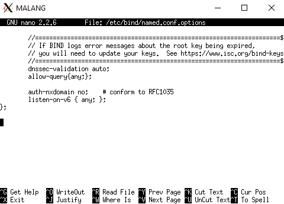
- Kemudian edit file /etc/bind/named.conf.local menjadi seperti gambar di bawah :
```
zone "semerud01.pw" {
	type master;
  	notify yes;
 	also-notify { 10.151.79.19 };
  	allow-transfer { 10.151.79.19 };
	file "/etc/bind/jarkom/semerud01.pw";
};
```

- Kemudian lakukan perintah `service bind9 restart` pada UML MALANG
- Lakukan perintah `nano /etc/bind/named.conf.options` pada UML MOJOKERTO
- Kemudian comment `dnssec-validation auto;` dan tambahkan baris berikut pada `/etc/bind/named.conf.options` </br>
`allow-query{any;};` </br>

- Lalu edit file `/etc/bind/named.conf.local` menjadi seperti gambar di bawah: </br>
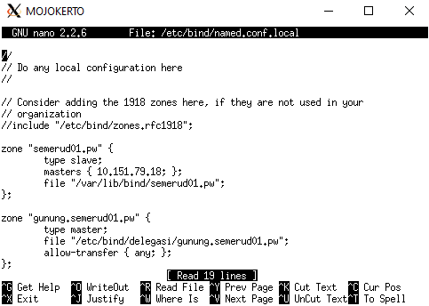
- lakukan perintah `cp /etc/bind/db.local /etc/bind/delegasi/gunung.semerud01.pw`, setelah sebelumnya telah membuat directory delegasi di dalam directory /etc/bind
- Kemudian edit file gunung.semerud01.pw menjadi seperti dibawah ini </br>
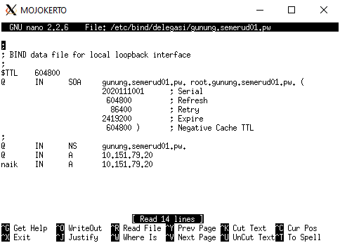
- Kemudian restart bind9 dengan perintah `service bind9 restart` pada UML MOJOKERTO
- Testing ping gunung.semerud01.pw dari UML GRESIK </br>
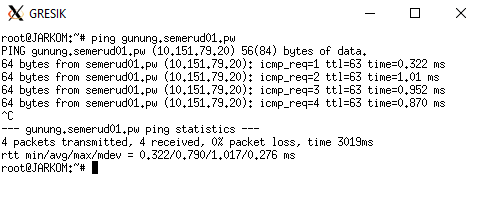

**7. Membuat subdomain dengan nama http://naik.gunung.semeruyyy.pw, domain ini diarahkan ke IP Server PROBOLINGGO.**
- Edit file dengan perintah `nano /etc/bind/delegasi/gunung.semerud01.pw` pada UML MOJOKERTO
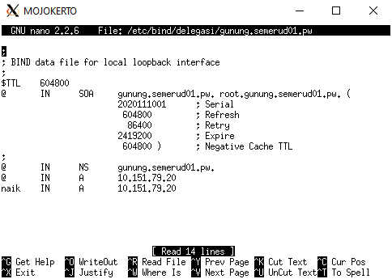
- Lalu lakukan perintah `service bind9 restart` pada UML MOJOKERTO
- Testing ping naik.gunung.semerud01.pw dari UML GRESIK </br>
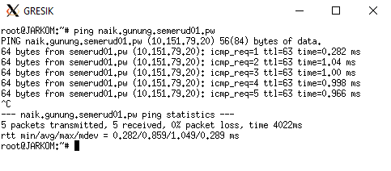
