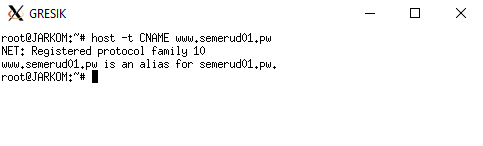
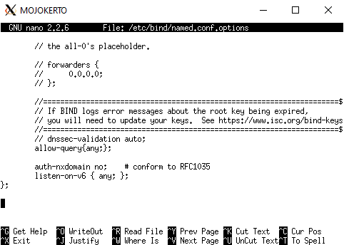
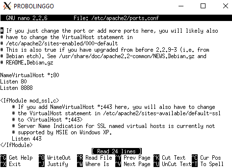
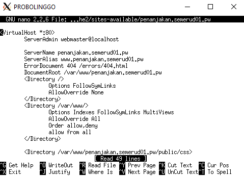

## Modul 2 : DNS dan Web Server

### No yang blm : 8,9,10,11,13

Nama anggota :
- 05111840000093 Muhammad Afif Fadhlurrahman 
- 05111740000091 Affan Ahsanul Habib

**1. Membuat alamat http://semeruyyy.pw**
- Pada UML MALANG jalankan perintah : </br>
`nano /etc/bind/named.conf.local`
- Isi konfigurasi seperti berikut (UML MALANG) :
```
zone "semerud01.pw" {
	type master;
  notify yes;
  also-notify { 10.151.79.19 };
	file "/etc/bind/jarkom/semerud01.pw";
};
```

- Isi konfigurasi pada file `/etc/bind/jarkom/semerud01.pw` seperti berikut (UML MALANG) : </br>

- Setelah selesai setting maka kita restart bind9 dengan perintah (UML MALANG) </br>
`service bind9 restart`
- Kemudian atur nameserver pada client (contoh pada UML GRESIK) </br>

- Testing (UML GRESIK) </br>


**2. alamat http://semeruyyy.pw memiliki alias http://www.semeruyyy.pw**
- Isi konfigurasi pada file `/etc/bind/jarkom/semerud01.pw` seperti berikut (UML MALANG) : </br> 
*yang perlu diperhatikan adalah record CNAME agar kita bisa membuat alias </br>

- Kemudian kita restart bind9 dengan perintah (UML MALANG) </br>
`service bind9 restart`
- Cek dengan melakukan host -t CNAME www.semeruyyy.pw. Hasilnya harus mengarah ke host dengan IP MALANG. </br>


**3. subdomain http://penanjakan.semeruyyy.pw yang diatur DNS-nya pada MALANG dan mengarah ke IP Server PROBOLINGGO**
- Lihat konfigurasi seperti pada gambar (file /etc/bind/jarkom/semerud01.pw) di UML MALANG, apakah sudah ada record A penanjakan pada filenya, karena hal tersebut yang menjadikan kita bisa membuat subdomain `penanjakan.semerud01.pw` </br>

- Lakukan perintah `service bind9 restart` pada UML MALANG
- Kemudian lakukan perintah `host -t A penanjakan.semerud01.pw` pada UML GRESIK </br>


**4. Membuat reverse domain untuk domain utama.**
- Buka file menggunakan perintah `nano /etc/bind/named.conf.local` pada UML MALANG
- Perhatikan konfigurasi berikut apakah sudah ada di dalam file named.conf.local
```
zone "79.151.10.in-addr.arpa" {
    type master;
    file "/etc/bind/jarkom/79.151.10.in-addr.arpa";
};
```
- Jalankan perintah `cp /etc/bind/db.local /etc/bind/jarkom/79.151.10.in-addr.arpa` pada UML MALANG
- Perhatikan dan edit sesuai pada gambar </br>

- Lakukan perintah `service bind9 restart` pada UML MALANG </br>
- Jalankan perintah `host -t PTR 10.151.79.20` </br>


**5. Membuat DNS Server Slave pada MOJOKERTO**
- Edit file /etc/bind/named.conf.local dan sesuaikan dengan syntax berikut pada UML MALANG
```
zone "semerud01.pw" {
	type master;
  	notify yes;
 	also-notify { 10.151.79.19 };
  	allow-transfer { 10.151.79.19 };
	file "/etc/bind/jarkom/semerud01.pw";
};
```
- Lakukan perintah `service bind9 restart` pada UML MALANG
- Kemudian buka file /etc/bind/named.conf.local pada MOJOKERTO dan tambahkan syntax berikut:
```
zone "semerud01.pw" {
    type slave;
    masters { 10.151.79.18 }; 
    file "/var/lib/bind/semerud01.pw";
};
```
- Lakukan perintah `service bind9 restart` pada UML MOJOKERTO
- Pada server MALANG matikan bind9 dengan perintah `service bind9 stop`
- Pada client GRESIK pastikan pengaturan nameserver mengarah ke IP MALANG dan IP MOJOKERTO </br>

- Lakukan ping ke semerud01.pw pada client GRESIK. </br>


**6. Membuat subdomain dengan alamat http://gunung.semeruyyy.pw yang didelegasikan pada server MOJOKERTO dan mengarah ke IP Server PROBOLINGGO.**
- Edit file dengan menggunakan perintah `nano /etc/bind/jarkom/semerud01.pw`, perhatikan record NS pastikan hal tersebut sudah sesuai (UML MALANG) </br>

- Edit file dengan menggunakan perintah `nano /etc/bind/named.conf.options`
- Kemudian comment `dnssec-validation auto;` dan tambahkan baris berikut pada `/etc/bind/named.conf.options` </br>
`allow-query{any;};` </br>

- Kemudian edit file /etc/bind/named.conf.local menjadi seperti gambar di bawah :
```
zone "semerud01.pw" {
	type master;
  	notify yes;
 	also-notify { 10.151.79.19 };
  	allow-transfer { 10.151.79.19 };
	file "/etc/bind/jarkom/semerud01.pw";
};
```

- Kemudian lakukan perintah `service bind9 restart` pada UML MALANG
- Lakukan perintah `nano /etc/bind/named.conf.options` pada UML MOJOKERTO
- Kemudian comment `dnssec-validation auto;` dan tambahkan baris berikut pada `/etc/bind/named.conf.options` </br>
`allow-query{any;};` </br>

- Lalu edit file `/etc/bind/named.conf.local` menjadi seperti gambar di bawah: </br>

- lakukan perintah `cp /etc/bind/db.local /etc/bind/delegasi/gunung.semerud01.pw`, setelah sebelumnya telah membuat directory delegasi di dalam directory /etc/bind
- Kemudian edit file gunung.semerud01.pw menjadi seperti dibawah ini </br>

- Kemudian restart bind9 dengan perintah `service bind9 restart` pada UML MOJOKERTO
- Testing ping gunung.semerud01.pw dari UML GRESIK </br>


**7. Membuat subdomain dengan nama http://naik.gunung.semeruyyy.pw, domain ini diarahkan ke IP Server PROBOLINGGO.**
- Edit file dengan perintah `nano /etc/bind/delegasi/gunung.semerud01.pw` pada UML MOJOKERTO

- Lalu lakukan perintah `service bind9 restart` pada UML MOJOKERTO
- Testing ping naik.gunung.semerud01.pw dari UML GRESIK </br>


**8. Domain http://semeruyyy.pw memiliki DocumentRoot pada /var/www/semeruyyy.pw. Awalnya web dapat diakses menggunakan alamat http://semeruyyy.pw/index.php/home.**</br>
- Lakukan perintah `nano /etc/apache2/sites-available/semerud01.pw` edit sesuai gambar dibawah ini</br>

- Download dengan perintah `wget 10.151.36.202/semeru.pw.zip` disimpan di directory /var/www/semerud01.pw</br>
- Aktifkan dengan perintah `a2ensite semerud01.pw`, kemudian restart apache dengan perintah `service apache2 restart`</br>
- Testing</br>


**9. Mengaktifkan mod rewrite agar urlnya menjadi http://semeruyyy.pw/home.**
- Pada **Probolinggo** jalankan perintah `a2enmod rewrite` untuk mengaktifkan *module rewrite*.</br>
- Restart apache dengan perintah `service apache2 restart`</br>
- Pindah ke directory `/var/www/semerud01.pw` dan buat file **.htaccess** dengan isi file</br>

- Pindah ke directory `/etc/apache2/sites-available` kemudian buka file **semerud01.pw** menjadi seperti</br>

- Restart apache dengan perintah `service apache2 restart`</br>
- Akses http://semeruyyy.pw/home</br>


**10. Web http://penanjakan.semeruyyy.pw akan digunakan untuk menyimpan assets file yang memiliki DocumentRoot pada /var/www/penanjakan.semeruyyy.pw dan memiliki struktur folder sebagai berikut:** </br>
/var/www/penanjakan.semeruyyy.pw
- /public/javascripts
- /public/css
- /public/images
- /errors

Saat mengakses http://penanjakan.semeruyyy.pw ditampilkan sebagai berikut</br>

Kemudian menuju folder `/public/`, terdapat folder di dalamnya, yaitu</br>

Sehingga sudah sesuai dengan struktur folder yang diinginkan.</br>

**11. Pada folder /public dibolehkan directory listing namun untuk folder yang berada di dalamnya tidak dibolehkan.**
- Pindah ke directory `/etc/apache2/sites-available` kemudian buka file **penanjakan.semerud01.pw** dan tambahkan</br>

- Restart apache dengan perintah `service apache2 restart`</br>
- Testing</br>


**12. Untuk mengatasi HTTP Error code 404, disediakan file 404.html pada folder /errors untuk mengganti error default 404 dari Apache.**
- Lakukan perintah `nano /etc/apache2/sites-available/penanjakan.semerud01.pw` </br>
- Tambahkan konfigurasi `ErrorDocument 404 /errors/404.html`</br>

- Lakukan perintah `service apache2 restart`</br>
- Testing</br>


**13. Untuk mengakses file assets javascript awalnya harus menggunakan url http://penanjakan.semeruyyy.pw/public/javascripts. Karena terlalu panjang maka dibuatkan konfigurasi virtual host agar ketika mengakses file assets menjadi http://penanjakan.semeruyyy.pw/js.**
- Pindah ke directory `/etc/apache2/sites-available` kemudian buka file **penanjakan.semerud01.pw** dan tambahkan</br>

- Restart apache dengan perintah `service apache2 restart`</br>
- Testing</br>


**14. Sedangkan web http://naik.gunung.semeruyyy.pw sudah bisa diakses hanya dengan menggunakan port 8888. DocumentRoot web berada pada /var/www/naik.gunung.semeruyyy.pw.**
- Lakukan perintah `nano /etc/apache2/sites-available/naik.gunung.semerud01.pw` edit sesuai gambar dibawah ini</br>

- Lakukan `service apache2 restart`</br>
- Download dengan perintah `wget 10.151.36.202/naik.gunung.semeru.pw.zip` disimpan di directory /var/www/naik.gunung.semerud01.pw</br>
- Aktifkan port dengan edit file dengan perintah `nano /etc/apache2/ports.conf` menjadi Listen 8888</br>

- Aktifkan dengan perintah `a2ensite naik.gunung.semerud01.pw`, kemudian restart apache dengan perintah `service apache2 restart`</br>
- Testing</br>


**15. membuat web http://naik.gunung.semeruyyy.pw agar diberi autentikasi password dengan username “semeru” dan password “kuynaikgunung” supaya aman dan tidak sembarang orang bisa mengaksesnya.**
- Lakukan perintah `nano /etc/apache2/sites-available/naik.gunung.semerud01.pw` dan setting AuthType, AuthName, AuthUserFile, Require valid-user </br>

- lakukan perintah `htpasswd -c /etc/apache2/.htpasswd semeru` pada UML PROBOLINGGO dengan username = `semeru` dan password = `kuynaikgunung` </br>

- Testing</br>


**16. Karena dirasa kurang profesional, maka setiap Bibah mengunjungi IP PROBOLINGGO akan dialihkan secara otomatis ke http://semeruyyy.pw.** </br>
- Lakukan perintah `nano /etc/apache2/sites-available/default`, lalu setting RewriteEngine, RewriteCond, RewriteCond, RewriteRule nya</br>

- Testing, ketika akses IP PROBOLINGGO maka akan dialihkan semerud01.pw</br>


**17. Karena pengunjung pada /var/www/penanjakan.semeruyyy.pw/public/images sangat banyak maka semua request gambar yang memiliki substring “semeru” akan diarahkan menuju semeru.jpg** </br>
- kita akan membuat file .htaccess dengan perintah `nano /var/www/penanjakan.semerud01.pw/.htaccess`</br>

- Kemudian pada file /etc/apache2/sites-available/penanjakan.semerud01.pw juga akan dimodifikasi agar file .htaccess dapat berjalan, dengan menambahkan `AllowOverride All`</br>

- Testing 1</br>

- Testing 2</br>

